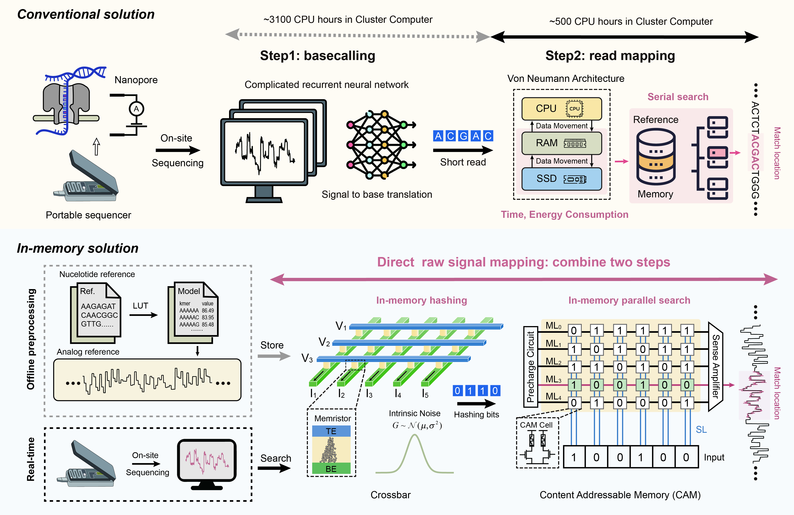

# Memristor based real-time genomic analysis

**Memristor based in-memory computing hardware-software co-design** for efficient on-site nanopore raw signal alignment. We simulate the performance of our method based on real-world memristor device and real nanopore sequencing data.



## Code structure

- `/code/random_conductance`: Real random memristor conductance array for LSH

- `/code/sequence_to_signal.py`: Transfer the nucleotide reference to analog reference according to the k-mer model
- `/code/cam_array.py`: Generate  the LSH reference and store in memristor based TCAM

- `/code/event_processor.py`: Generate events from raw signals
- `/code/cam_search.py`: Search the memristor based TCAM
- `/code/cam_process.py`: Process the search results (votes) to decide the mapping result
- `/code/pafstats.py`: Compare the simulation result with ground truth (minimap2), and calculate the F1 score
- `/code/lsh.py`: Simulate the memristor based raw signal alignment

## Installation

Run following command in your Linux terminal:

```shell
git clone https://github.com/peiyihe/Mem_RT_Genomics.git
cd CIM-Raw-Signal-Alignment
```

Create conda environment and install:

```shell
conda create --name test_lsh python=3.8
conda activate test_lsh
pip install -r requirements.txt
```

## Raw Signal Mapping

**Examples:**

```shell
cd code
python -u lsh.py \
  --read_number 1000 \
  --threshold 7 \
  --sample_number 4000 \
  --std 2 \
  --file_path "../dataset/SP1-mapped500.fast5"
```

**Optional arguments:**

- `read_number`: Maximum numbers of raw signal to map
- `threshold`: TCAM threshold value
- `sample_number`: Maximum number of raw signal samples. For example, with R9.4.1 nanopore sequencing, 4000 samples are collected per second.
- `std`: The memristor conductance variation in TCAM is set to 2 µS.
- `file_path`: Input raw signal file path

**Warning:**  We only show 1000 reads as example, to reproduce the original result in our paper, you have to download the dataset according to `/dataset/all_id.txt`. And also you need to generate the new ground truth file by [minimap2](https://github.com/lh3/minimap2), the generated new ground true file should be named as **minimap2_sars2.paf** and replace the old version in `/code/result_template/minimap2_sars2.paf`.

## Simulation results

We integrate `uncalled pafstats` functionality from [UNCALLED](https://github.com/skovaka/UNCALLED) and compare the mapping locations from our method with locations from [minimap2](https://github.com/lh3/minimap2) (Ground truth), and calculate the F1 scores.

**Example:**

```shell
Summary: 1000 reads, 968 mapped (96.80%)

Comparing to reference PAF
     P     N
T  94.90  0.00
F   1.90  3.20
NA: 0.00

Recall: 96.74

Precision: 98.04

F1: 97.38
```

**NA** means minimap2 doesn't report the location but our method does. It is considered as False Positives here.

## Acknowledgement

The segmentation code is implemented by [UNCALLED4](https://github.com/skovaka/uncalled4), and segmentation parameters are from [sigmap](https://github.com/haowenz/sigmap) and [UNCALLED](https://github.com/skovaka/UNCALLED). The authors would like to thank Sam Kovaka, Hasindu Gamaarachchi, and Can Firtina for their thorough explanations and insightful discussions.